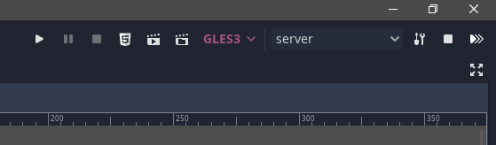
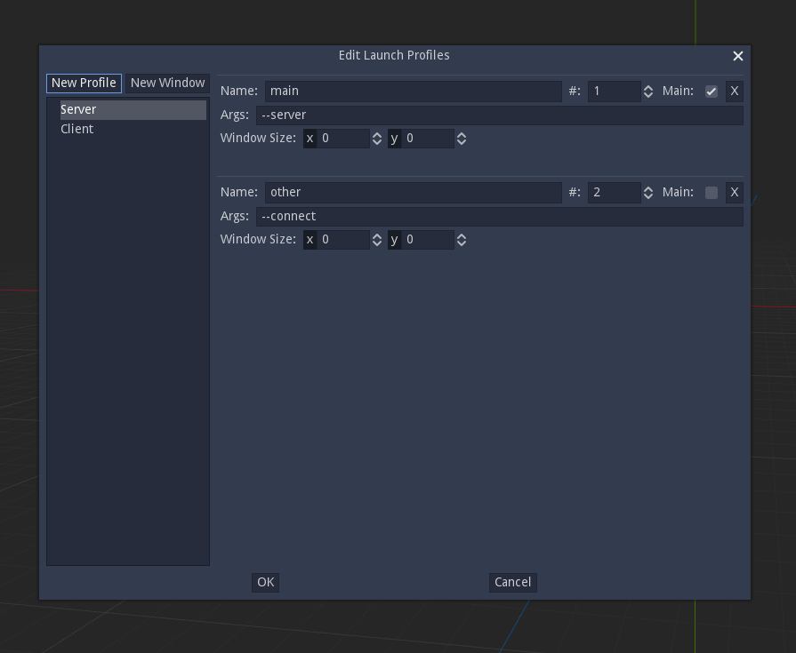
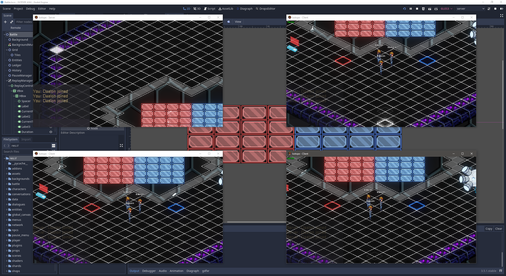

# OmniLaunch

Launch multiple instances of your game and pass custom command line arguments to each one.

Maintain multiple, highly configurable profiles and quickly switch between them.

# Screenshots

## Adds a toolbar to the top-right of the editor

## Edit launch profiles easily

## Launch multiple game instances with a single button

# TODO

- ~~add 'kill windows' button~~
- ~~profile editing~~
  - ~~new~~
  - ~~rename~~
  - ~~delete~~
  - copy
- ~~button icons~~
- ~~window layout~~
- advanced window layout
- more features:
  - window title overrides
  - manual window positions
  - ~~implement window size~~
- steal features from https://github.com/dreadpon/multirun